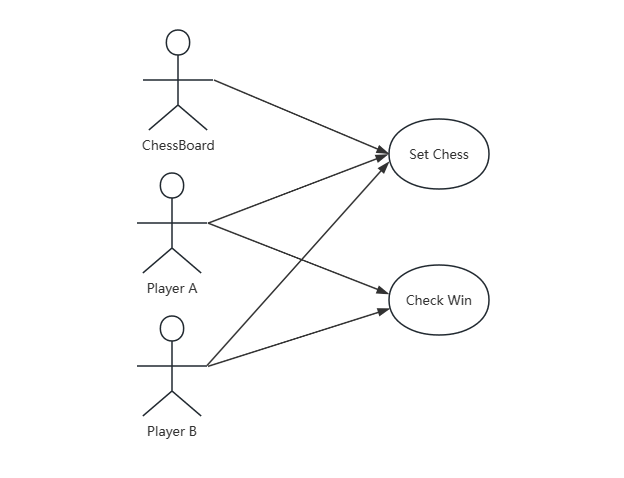
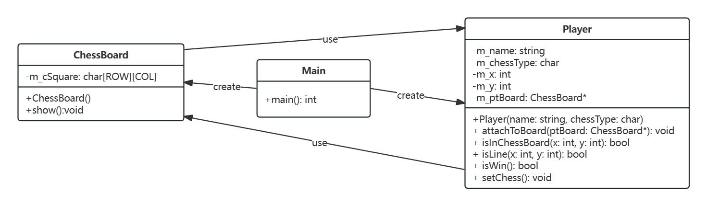
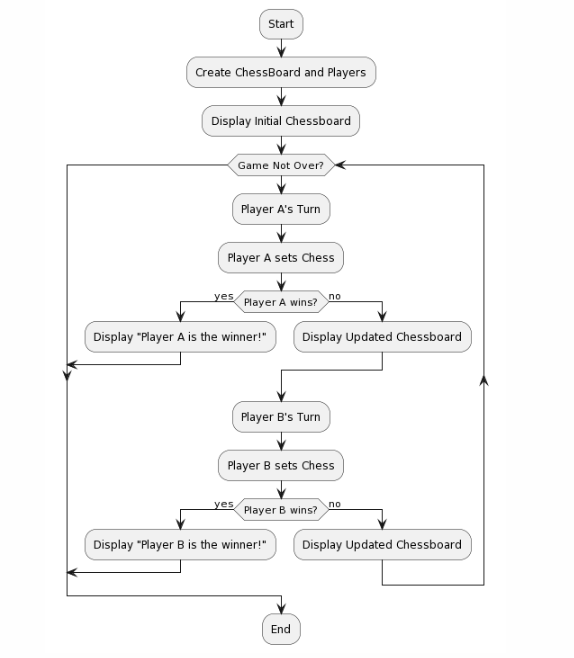
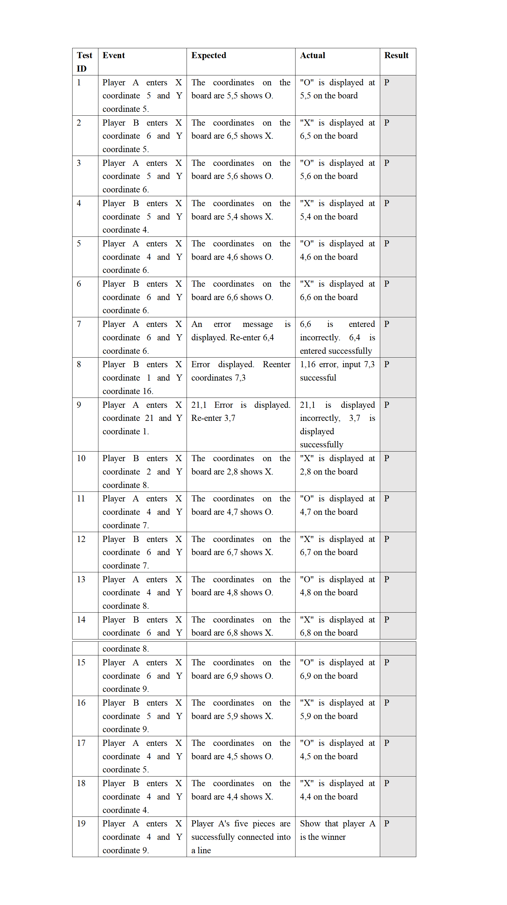

# COMP3016 Coursework1

## System Version
Visual Studio Version:** [Visual Studio 2022(17.1.0)] 
Operating System Version:** [Windows10 Home Edition 22H2]

## Description
The game code implements a simple console-based two-player pentoku game. Players A and player B take turns entering their desired coordinates on a 21x16 board. The pieces are displayed at the corresponding coordinates. Player A enters the X and Y coordinates of the position to be played, and then it is the turn of player B to enter the X and Y coordinates. And so on, both sides need to surround each other, and the other piece cannot be connected into five. When one of the players' pieces takes the lead in connecting five pieces horizontally, vertically or diagonally, that player wins.

## UML Design Diagram
use case diagram:  
 
class diagram:  
 
activity diagram:  

## Test Case

## Video Link
YouTube: https://youtu.be/eCIRjhZxsu0

## Git Repository
GitHub: https://github.com/QihaoHan/COMP3016-CW1
